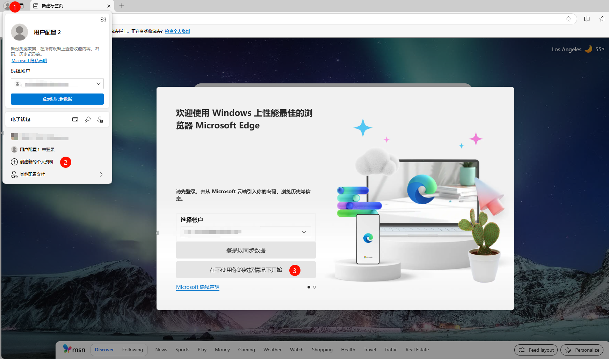
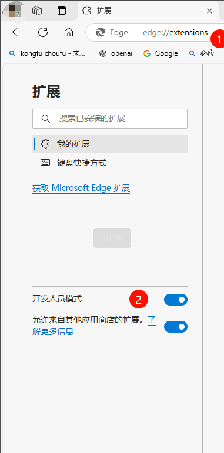
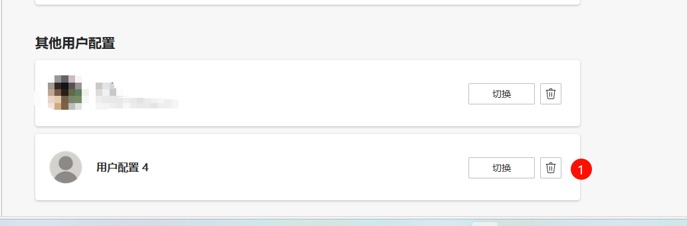

## Introduction

### Possible Causes of Script Issues

1. Script malfunction
2. Interference from other plugins or scripts
3. Account blacklisted
4. Browser environment issues

### Testing Environment Requirements

- Microsoft Edge Browser (Recommended version: 133.0.3065.69 or compatible version)

## Testing Steps

### 1. Prepare Testing Environment

1. Create New Profile

   - Click the profile icon in the top right corner
   - Select "Add" to create a new profile
     

2. Install Required Extensions

   - Install Tampermonkey Extension: [Official Download](https://www.tampermonkey.net/index.php?browser=chrome)
   - Install Ad Blocking Script: [Script Download Link](https://greasyfork.org/zh-CN/scripts/480192-%E5%93%8E%E5%91%A6%E4%B8%8D%E9%94%99%E5%93%A6-%E5%AD%A6%E4%BC%9A%E7%9C%8B%E7%AE%80%E4%BB%8B-%E9%BB%91%E5%8F%B7%E5%A5%BD%E5%83%8F%E8%83%BD%E7%94%A8%E4%BA%86-%E5%8F%8D%E9%A6%88%E4%B8%80%E4%B8%8B)

3. Enable Developer Mode
   - Visit edge://extensions/
   - Turn on Developer Mode
     

### 2. Execute Testing

1. Open YouTube and confirm script is enabled

2. **Phase 1 Testing (Without Login)**

   1. **Important: Remain logged out**
   2. Watch videos for about 20 minutes
   3. Switch to a new video every 3-5 minutes
   4. Record test results:
      - If no ads appear ➡️ Script is working normally, proceed to Phase 2
      - If ads appear ➡️ Script malfunction, please collect the following information:
        - 2444 logs
        - Specific video URL where ads appeared
        - Ad placement details

3. **Phase 2 Testing (With Login)**
   1. Log in with your YouTube account
   2. Continue watching videos for 20 minutes
   3. Switch to a new video every 3-5 minutes
   4. Record test results:
      - If still no ads ➡️ Account normal, script working properly
      - If ads suddenly appear ➡️ Account might be added to YouTube's ad whitelist (ad-blocking blacklist)
      - If ads appeared before in your original environment but not in this test environment ➡️ Other plugins in your original environment might be causing interference

### 3. Clean Up Testing Environment

1. Visit edge://settings/profiles
2. Find "Other profiles" and delete the test profile
   
