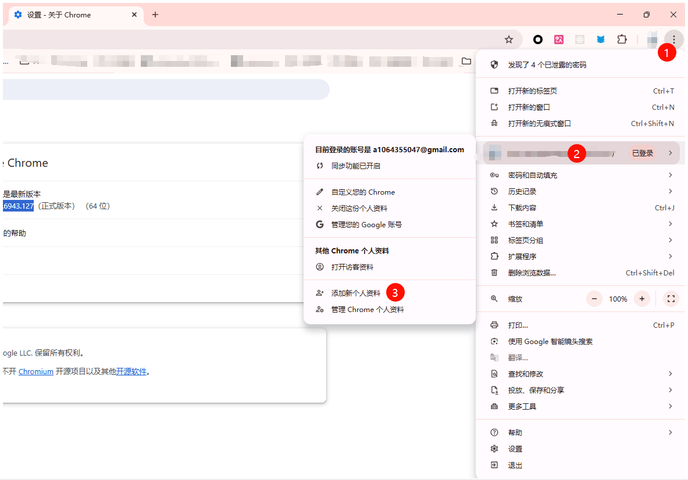
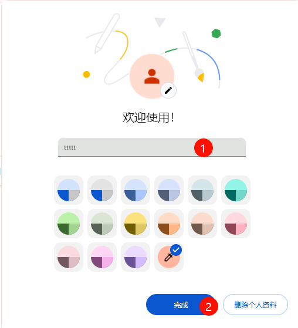
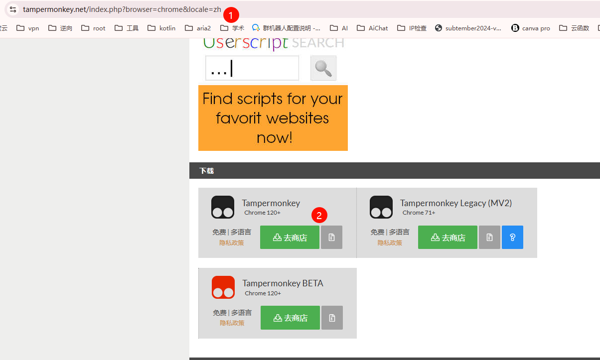
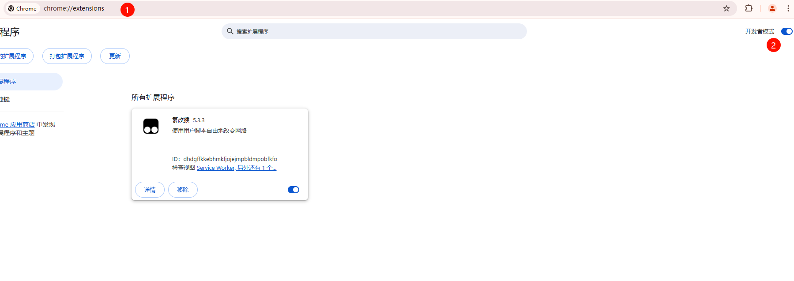
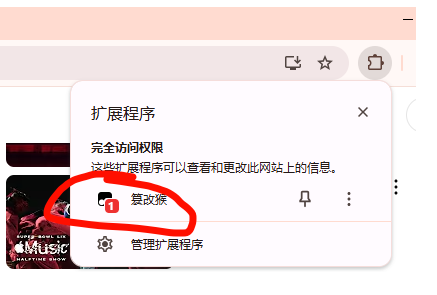
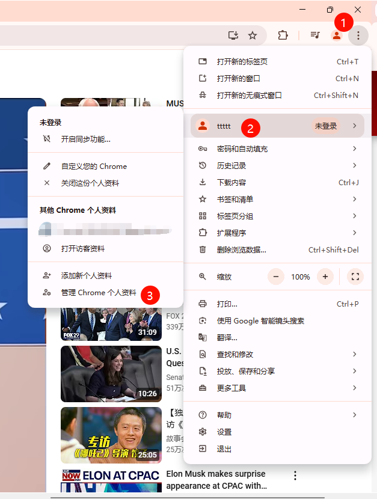
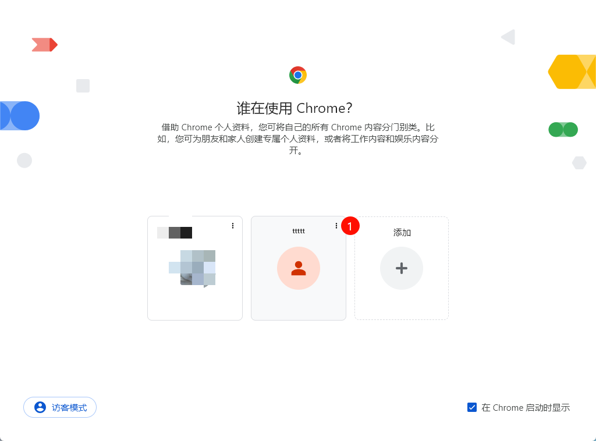

# YouTube 广告屏蔽脚本测试指南 - Chrome 浏览器版本

## 前言

### 脚本异常的可能原因

1. 脚本本身异常
2. 插件或其他脚本干扰
3. 账号被加入黑名单
4. 浏览器环境异常

### 测试环境要求

- Google Chrome 浏览器 (推荐版本：133.0.6943.127 或兼容版本)

## 测试步骤

### 1. 准备测试环境

1. 创建新的个人资料

   - 点击右上角个人头像
   - 选择"添加"创建新的配置文件
     
     

2. 安装必要插件
   - 安装 Tampermonkey 插件：[官方下载地址](https://www.tampermonkey.net/index.php?browser=chrome)
     
3. 启用开发者模式
   - 访问 chrome://extensions/
   - 开启右上角"开发者模式"
     

### 2. 安装和测试脚本

1. 安装广告屏蔽脚本：[脚本下载地址](https://greasyfork.org/zh-CN/scripts/480192-%E5%93%8E%E5%91%A6%E4%B8%8D%E9%94%99%E5%93%A6-%E5%AD%A6%E4%BC%9A%E7%9C%8B%E7%AE%80%E4%BB%8B-%E9%BB%91%E5%8F%B7%E5%A5%BD%E5%83%8F%E8%83%BD%E7%94%A8%E4%BA%86-%E5%8F%8D%E9%A6%88%E4%B8%80%E4%B8%8B)

2. 执行测试

   - 打开 YouTube，确认脚本已启用
     

   - **第一阶段测试（未登录状态）**

     1. **重要：保持未登录状态**
     2. 观看视频约 20 分钟
     3. 每 3-5 分钟切换一个新视频
     4. 记录测试结果：
        - 如果完全没有广告 ➡️ 脚本运行正常，继续第二阶段测试
        - 如果出现广告 ➡️ 脚本异常，请收集以下信息进行反馈：
          - 2444 日志
          - 广告出现时的具体视频链接
          - 广告位置等

   - **第二阶段测试（登录状态）**
     1. 使用您的 YouTube 账号登录
     2. 继续观看视频 20 分钟
     3. 每 3-5 分钟切换一个新视频
     4. 记录测试结果：
        - 如果仍然没有广告 ➡️ 账号正常，脚本运行正常
        - 如果突然出现广告 ➡️ 账号可能已被 YouTube 加入广告白名单（即广告屏蔽黑名单）
        - 如果之前使用此账号时有广告，现在测试环境中没有 ➡️ 说明原环境中可能存在其他插件干扰

### 3. 清理测试环境

1. 删除测试用的个人资料
   
   
